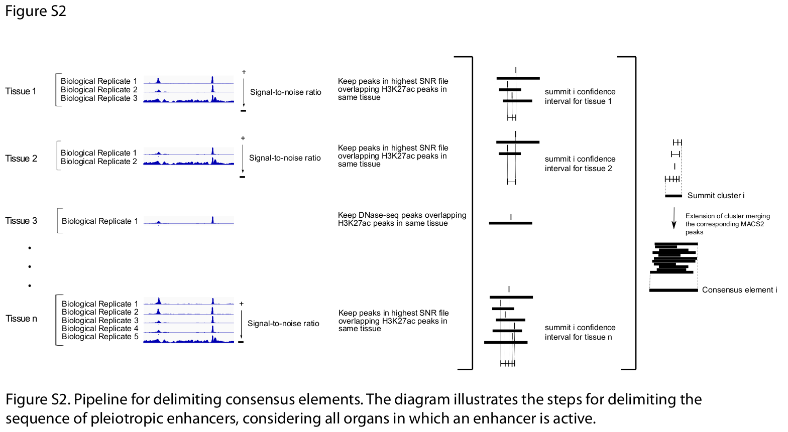
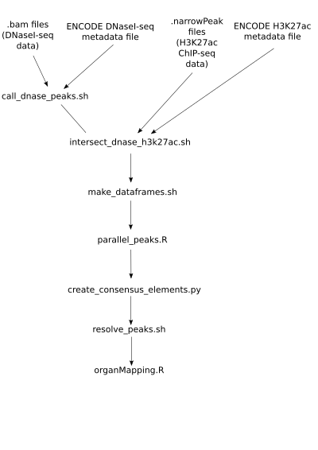

[](https://www.gnu.org/licenses/gpl-3.0)
# Human pleiotropic enhancers

Code to recreate the consensus distal regulatory elements (a.k.a ENCODE enhancers) of Laiker & Frankel 2021 "Pleiotropic enhancers are ubiquitous regulatory elements in the human genome" (DOI:10.1101/2022.01.25.477532, https://biorxiv.org/cgi/content/short/2022.01.25.477532v1).


- [Overview](#overview)
- [System Requirements](#system-requirements)
- [Installation](#installation)
- [How to run](#how-to-run)

## Overview

Consensus distal regulatory elements are open (DNaseI-seq peaks) and acetylated (with the H3K27ac histone mark) elements present in one or more of the 
spatio-temporal contexts (organs, tissues or cell types). The pipeline to obtain these elements from DNaseI-seq experiments BAM alignment files and
enriched H3K27ac genomic regions bed files is summarized in the figure. Briefly, DNaseI-seq bam files are feeded to the MACS2 peakcaller algorithm and processed in parallel with GNU-parallel. This step outputs narrowPeak files (bed files) with the open chromatin elements genomic coordinates for each experiment. 





Then, the Signal To Noise Ratio (SNR) of each of these experiments is estimated with featureCounts and the narrowPeak with its corresponding BAM file. For each context, the higher SNR experiment is used as an anchor to create summit confidence intervals for each tissue. These intervals are then intersected between tissues to create summit clusters (genomic regions with high density of acetylated open chromatin summits). These clusters are then extended using the previously called MACS2 peaks and elements overlapping more than a given threshold are merged. Each consensus element is then annotated based on the tissues it was found active. Similar tissues (of the same organ) are then collapsed to the corresponding organ.
The pipeline structure is depicted in the following figure:





## System requirements
### OS requirements
The code has been tested on Ubuntu 20.04.3 LTS

### Dependencies
The following packages are needed to run the code

```
GNU parallel
MACS2
bedtools
bedops
samtools
curl (to download ENCODE data)
awk
R
```

### R packages dependencies
The following R packages are needed to run the code

```
tidyverse
optparse
doParallel
```

### python3 packages dependencies
The following python3 packages are needed to run the code

```
pandas
```

## Installation
Install from git
```
git clone https://github.com/laiker96/human_pleiotropic_enhancers
cd human_pleiotropic_enhancers
```
You should then add the repository to your $PATH environment variable.


## How to run
All DNaseI-seq BAM files must be on the same directory and named as ```<ACCESSION_ID>.bam``` and similarly BAM index bai files as ```<ACCESSION_ID>.bam.bai```. BAM files used in the paper can be downloaded with:
```
$ download_ENCODE_files.sh DNase_datasets_ENCODE_Roadmaps_metadata.tsv "BAM" <THREADS>
```
Similarly, all H3K27ac ChIP-seq narrowPeak.gz files can be downloaded with the same script:
```
$ download_ENCODE_files.sh H3K27ac_datasets_ENCODE_Roadmaps_metadata.tsv "narrowPeak" <THREADS>
```
You should decompress these .gz files with ```gunzip```.

To run the whole pipeline from the BAM and narrowPeak files:
```
$ create_consensus_elements.sh DNase_datasets_ENCODE_Roadmaps_metadata.tsv H3K27ac_datasets_ENCODE_Roadmaps_metadata.tsv <THREADS> <OVERLAP_FRACTION_REPLICATES> <OVERLAP_FRACTION_CONSENSUS_ELEMENTS> ENCODE_TissueFacets_metadata.tsv
```
